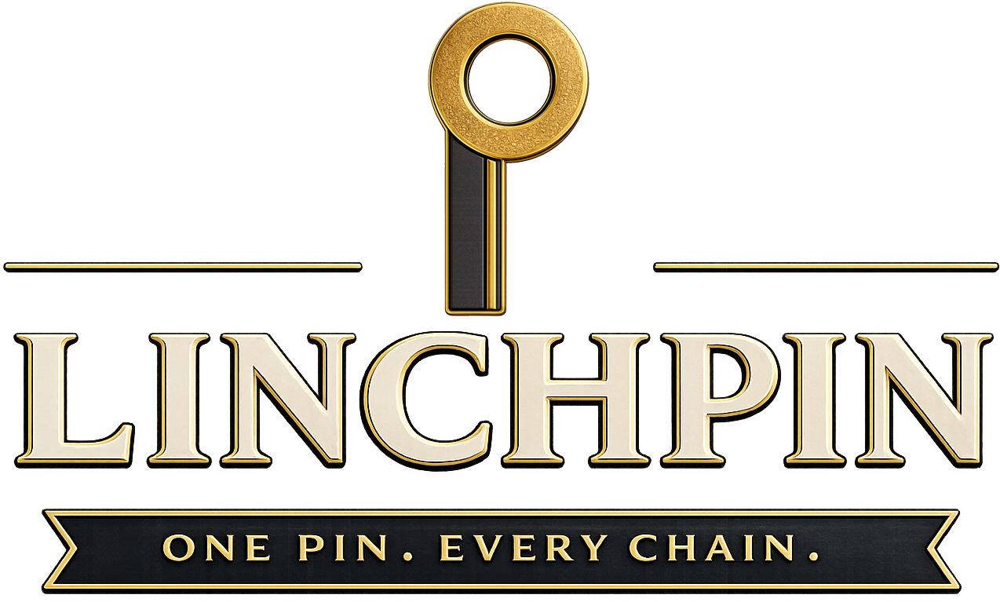

  

  <a href="https://linchpinland.com">linchpinland.com</a>

Linchpin is a land services company based in Houston, TX. We do mineral title examination — runsheets, chains of title, due diligence — the work that keeps deals moving and operators confident in what they own.
Our team comes from the title industry, but also from finance, data science, law, sales, project management, and a few places in between. We've sat in county clerk offices, read the microfilm, built the spreadsheets, and certified the work. We've also built cutting-edge technology, closed deals in boardrooms, and managed projects across the globe.
We know what good title looks like because we've been doing it. And we know a few other things, too.
We're working on something. Stay tuned.

  © 2026 Linchpin Land LLC

